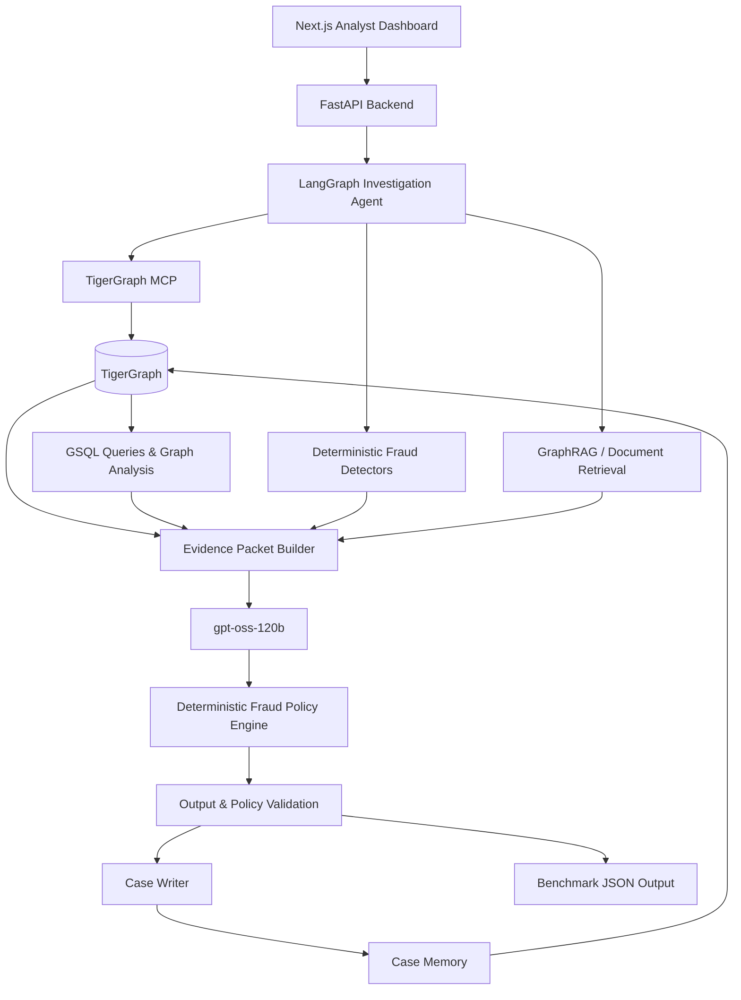

# TigerGraph × Hacker House Goa 2026 — Agentic Fraud Detective

An agentic fraud investigation system built for the **TigerGraph × Hacker House Goa 2026 Hackathon**.

The system investigates suspicious card activity using **TigerGraph**, **TigerGraph MCP**, **GraphRAG**, **LangGraph**, deterministic fraud-analysis and policy components, and **`openai/gpt-oss-120b`** for evidence synthesis and agentic reasoning.

The central design principle is a strict separation between:

* **Deterministic investigation and compliance logic** — graph traversal, calculations, fraud-pattern detection, policy enforcement, approval routing, validation, and case persistence.
* **Agentic reasoning** — deciding what evidence to investigate, synthesizing retrieved evidence, handling uncertainty, deciding when additional evidence is useful, and producing explanations.

The result is not a generic chatbot. It is a stateful investigation workflow that moves from an alert to evidence, uncertainty assessment, controlled evidence gathering, policy-constrained actions, case memory, and a defensible final investigation record.

---

## Table of Contents

* [1. Problem](#1-problem)
* [2. Hackathon Requirements Addressed](#2-hackathon-requirements-addressed)
* [3. Solution Overview](#3-solution-overview)
* [4. Architecture](#4-architecture)
* [5. Deterministic vs Agentic Responsibilities](#5-deterministic-vs-agentic-responsibilities)
* [6. Investigation Workflow](#6-investigation-workflow)
* [7. Technology Stack](#7-technology-stack)
* [8. TigerGraph Knowledge Graph](#8-tigergraph-knowledge-graph)
* [9. TigerGraph MCP](#9-tigergraph-mcp)
* [10. GraphRAG](#10-graphrag)
* [11. Fraud Detection and Pattern Analysis](#11-fraud-detection-and-pattern-analysis)
* [12. LangGraph Agent](#12-langgraph-agent)
* [13. Evidence Gathering](#13-evidence-gathering)
* [14. Fraud Probability and Uncertainty](#14-fraud-probability-and-uncertainty)
* [15. Deterministic Fraud Policy Engine](#15-deterministic-fraud-policy-engine)
* [16. Approval Routing](#16-approval-routing)
* [17. Next Best Action](#17-next-best-action)
* [18. Case Memory](#18-case-memory)
* [19. Suspicious Activity Reports](#19-suspicious-activity-reports)
* [20. Case Output Format](#20-case-output-format)
* [21. Benchmark Cases](#21-benchmark-cases)
* [22. Repository Structure](#22-repository-structure)
* [23. Free / Zero-Cost Architecture](#23-free--zero-cost-architecture)
* [24. Setup](#24-setup)
* [25. Running the System](#25-running-the-system)
* [26. Validation](#26-validation)
* [27. Analyst Dashboard](#27-analyst-dashboard)
* [28. Observability](#28-observability)
* [29. Testing](#29-testing)
* [30. Design Decisions](#30-design-decisions)
* [31. Limitations](#31-limitations)
* [32. Future Improvements](#32-future-improvements)
* [33. Hackathon Deliverables](#33-hackathon-deliverables)

---

# 1. Problem

Fraud investigation is not simply a binary classification problem.

A suspicious transaction can be legitimate, while a transaction with a low risk score can still be fraudulent. A useful investigation therefore has to combine multiple sources of evidence:

* transaction history
* customer and card behavior
* device information
* billing regions
* connected cards
* shared entities
* historical fraud investigations
* fraud patterns
* bank policy
* regulatory guidance

The challenge dataset intentionally removes the original fraud label. Each transaction instead contains a **risk score**, which is an input to an investigation rather than a final fraud verdict.

The benchmark therefore requires the system to investigate the evidence surrounding each alert and determine:

1. Whether the activity is fraudulent, legitimate, or uncertain.
2. What fraud pattern is present, if any.
3. How far the activity extends across transactions and connected entities.
4. Whether additional evidence is required.
5. What action should be recommended.
6. Who must approve that action.
7. Whether a suspicious activity report is required.
8. When the investigation should stop.
9. How the investigation should be stored as reusable case memory.

The dataset README explicitly states that the risk score is an input and not the answer, and that closed investigations are the source of confirmed outcomes.

---

# 2. Hackathon Requirements Addressed

The implementation is designed around the core requirements of the challenge:

* TigerGraph as the graph database.
* GSQL and graph-based investigation.
* TigerGraph MCP as the agent's graph interface.
* GraphRAG for combining graph evidence and textual evidence.
* An agentic investigation workflow.
* Case creation and progression.
* Historical case memory.
* Controlled evidence requests.
* Policy-constrained next-best actions.
* Approval routing.
* Explainable investigation results.
* Case persistence in the graph.
* A user interface for investigation and case progression.
* Output for all 20 benchmark cases.

The challenge describes the intended investigation flow as:

**Trigger → Investigate → Gather Evidence → Assess Uncertainty → Gather More Evidence if Needed → Take Next Action → Explain Decision → Update Case Memory**

This project implements that flow as a stateful LangGraph workflow.

---

# 3. Solution Overview

The system starts with a fraud investigation trigger.

A trigger can originate from:

* a risk score
* a customer report
* an analyst request

The agent creates an investigation state and progressively gathers evidence.

Instead of giving the LLM the entire dataset, the system first retrieves focused evidence from TigerGraph and the document knowledge base.

The evidence is then compressed into an **evidence packet**.

`gpt-oss-120b` receives that evidence packet and performs reasoning such as:

* interpreting the evidence
* comparing competing hypotheses
* assessing uncertainty
* deciding whether additional evidence is useful
* selecting the next investigation step
* explaining the investigation

The model does **not** directly control the final policy decision.

All proposed actions pass through the deterministic policy engine, which verifies:

* whether the action is allowed
* which policy rule applies
* whether the action requires approval
* whether the approval route is `auto`, `L1`, or `L2`
* whether the action is consistent with the available evidence

The completed case is then written back into TigerGraph so future investigations can retrieve it as memory.

---

# 4. Architecture



---

# 5. Deterministic vs Agentic Responsibilities

A major design objective is preventing the project from becoming a simple LLM wrapper.

## Deterministic Components

The following operations are intentionally deterministic:

* transaction retrieval
* graph traversal
* transaction-window analysis
* exposure calculation
* connected-card discovery
* shared-device discovery
* shared-region discovery
* known fraud-pattern detection
* policy evaluation
* approval routing
* action validation
* entity-ID validation
* JSON schema validation
* case persistence
* benchmark output validation

These operations should produce reproducible results for the same data.

## Agentic Components

The LLM and LangGraph workflow are responsible for:

* choosing useful investigation steps
* synthesizing heterogeneous evidence
* comparing competing explanations
* assessing uncertainty
* deciding whether additional evidence is needed
* retrieving and using relevant case memory
* explaining why evidence matters
* producing a human-readable investigation summary
* drafting SAR narratives from validated evidence

This separation allows the LLM to reason without allowing it to bypass the deterministic compliance layer.

---

# 6. Investigation Workflow

The investigation is implemented as a stateful LangGraph workflow.

```text
START
  │
  ▼
Load Case
  │
  ▼
Create Investigation
  │
  ▼
Inspect Trigger
  │
  ▼
Retrieve Flagged Transaction
  │
  ▼
Investigate Customer
  │
  ▼
Investigate Card History
  │
  ▼
Investigate Transaction Window
  │
  ▼
Investigate Devices
  │
  ▼
Investigate Regions
  │
  ▼
Investigate Connected Cards
  │
  ▼
Retrieve Similar Closed Cases
  │
  ▼
Detect Fraud Patterns
  │
  ▼
Build Evidence Packet
  │
  ▼
LLM Evidence Synthesis
  │
  ▼
Assess Uncertainty
  │
  ▼
Policy Evaluation
  │
  ├────────────── Enough Evidence ──────────────┐
  │                                             │
  │                                             ▼
  │                                      Recommend Actions
  │                                             │
  │                                             ▼
  │                                      Write Case
  │                                             │
  │                                             ▼
  │                                      Update Graph Memory
  │                                             │
  │                                             ▼
  │                                      Generate SAR if required
  │                                             │
  │                                             ▼
  │                                      Validate Output
  │                                             │
  │                                             ▼
  │                                      Save JSON
  │                                             │
  │                                             ▼
  │                                            END
  │
  └──────────── More Evidence Required
                    │
                    ▼
             Request Evidence
                    │
                    ▼
             Simulate Response
                    │
                    ▼
             Update Evidence
                    │
                    ▼
             Reassess Case
                    │
                    └───────────────► Policy Evaluation
```

The investigation can therefore change its recommendation when new evidence arrives.

---

# 7. Technology Stack

## Backend

* Python 3.11+
* FastAPI
* Pydantic v2
* Uvicorn
* LangGraph

## LLM

* `openai/gpt-oss-120b`
* OpenAI-compatible provider interface
* Free provider configuration through the project's supported provider abstraction

## Graph

* TigerGraph Savanna or Community Edition
* GSQL
* TigerGraph MCP
* TigerGraph graph traversal and retrieval

## GraphRAG

* TigerGraph graph evidence
* Document retrieval
* Historical closed-case retrieval
* Local embedding/retrieval components where configured

## Frontend

* Next.js
* React
* TypeScript
* Tailwind CSS

## Validation

* Pydantic
* deterministic policy validation
* benchmark schema validation

---

# 8. TigerGraph Knowledge Graph

TigerGraph is the central investigation knowledge graph.

The graph connects the entities that matter during fraud investigation.

## Main Vertices

```text
Customer
Card
Transaction
DeviceProfile
EmailDomain
BillingRegion
ClosedCase
FraudCase
```

## Main Relationships

```text
Customer
   │
   └── OWNS ──> Card
                    │
                    └── MADE ──> Transaction
                                      │
                                      ├── FROM_DEVICE ──> DeviceProfile
                                      ├── PURCHASER_EMAIL ──> EmailDomain
                                      └── BILLED_IN ──> BillingRegion

Transaction ── NEXT ──> Transaction

ClosedCase ── INVOLVES ──> Transaction
ClosedCase ── ON_CARD ──> Card
ClosedCase ── CONNECTED_TO ──> Card

FraudCase ── INVOLVES ──> Transaction
FraudCase ── ON_CARD ──> Card
FraudCase ── RELATED_TO ──> DeviceProfile
FraudCase ── CONNECTED_TO ──> Card
FraudCase ── SIMILAR_TO ──> ClosedCase
```

The graph makes relationships that are difficult to inspect in a flat transaction table directly queryable.

For example:

```text
Transaction
     ↓
DeviceProfile
     ↓
Other cards
     ↓
Other customers
     ↓
Previous fraud cases
```

This enables the investigation to identify relationships across customers and cards.

---

# 9. TigerGraph MCP

TigerGraph MCP provides the interface between the agent and TigerGraph.

Instead of allowing the LLM to construct arbitrary database operations, the application exposes controlled investigation tools.

Representative tools include:

```text
get_transaction
get_customer_history
get_card_history
get_transaction_window
get_device_neighbors
get_region_neighbors
get_email_neighbors
get_connected_cards
get_prior_cases
get_transaction_chain
find_shared_device_activity
find_shared_region_activity
find_card_testing_sequence
write_case_to_graph
```

Each tool has a defined input and output schema.

The agent therefore interacts with the graph through controlled capabilities rather than unrestricted database access.

---

# 10. GraphRAG

GraphRAG combines two kinds of evidence.

## Structured Graph Evidence

Examples:

* transaction relationships
* card history
* device relationships
* region relationships
* connected cards
* previous fraud cases

## Textual Evidence

Examples:

* fraud policy
* known fraud patterns
* closed-case narratives
* regulatory references

The system retrieves only the relevant information for the current investigation.

The resulting context is assembled into an evidence packet.

Example:

```text
CASE
HHG-014

TRIGGER
Analyst request concerning a shared unusual device.

FLAGGED TRANSACTION
Transaction 3478561
Card C13487-K1

TRANSACTION EVIDENCE
...

DEVICE EVIDENCE
...

CONNECTED CARD EVIDENCE
...

PRIOR CASE EVIDENCE
...

PATTERN EVIDENCE
...

POLICY EVIDENCE
R6
R8
R9

CONTRADICTORY EVIDENCE
...

OPEN QUESTIONS
...
```

This approach reduces unnecessary context and makes the reasoning traceable.

---

# 11. Fraud Detection and Pattern Analysis

The system recognizes the five documented patterns in the dataset as well as undocumented coordinated activity.

## 11.1 Card Testing

Card testing involves a sequence such as:

```text
small online authorization
        ↓
small online authorization
        ↓
small online authorization
        ↓
larger purchase
```

The policy describes three or more small online authorizations within an hour followed by a larger purchase as the characteristic sequence.

The detector therefore analyzes transaction order, amount, channel and timing.

---

## 11.2 Card-Not-Present Fraud

The system examines online activity that is inconsistent with the cardholder's historical behavior.

Signals can include:

* unusual transaction amounts
* unusual product behavior
* bursts of activity
* unusual transaction timing
* deviations from previous card behavior

A single unusual online purchase is not automatically treated as fraud.

---

## 11.3 Card-Not-Present Fraud from a New Device

This combines online fraud evidence with identity/device information.

The investigation checks for:

* a device marked as new
* unusual browser or operating-system information
* proxy-related signals
* behavior inconsistent with historical activity
* device reuse across other cards

A new device is treated as evidence, not proof by itself.

---

## 11.4 Out-of-Region Use

The system compares current activity with the cardholder's historical regional behavior.

It considers:

* historical billing region
* current billing region
* duration of activity
* repeated activity in the new region
* whether normal activity continues at home

The investigation must distinguish suspicious regional activity from behavior that could represent ordinary travel.

---

## 11.5 Account Takeover

Account takeover analysis combines multiple signals.

Potential evidence includes:

* mixed-channel activity
* device anomalies
* identity anomalies
* match-flag changes
* unusual transaction behavior
* activity inconsistent with the cardholder

The goal is to determine whether the activity points toward compromised credentials rather than simply a stolen card number.

---

## 11.6 Undocumented Patterns

The system does not force every suspicious case into one of the five known categories.

If coordinated or repeated abuse is present but does not fit a documented pattern, the case can be classified as:

```text
undocumented
```

The system then describes:

* what the pattern is
* who or what it affects
* how the relationship was discovered
* why it does not fit the documented categories

---

# 12. LangGraph Agent

LangGraph provides the stateful orchestration layer.

The investigation state contains information such as:

```text
case_id
trigger
flagged_transaction
customer_context
card_context
transaction_evidence
device_evidence
region_evidence
connected_card_evidence
prior_cases
pattern_candidates
evidence_packet
fraud_probability_initial
fraud_probability_final
evidence_requests
evidence_responses
initial_actions
final_actions
policy_references
sar_required
stop_reason
graph_case_id
tool_calls
tokens
latency
errors
```

Each LangGraph node performs a specific task.

This makes the investigation:

* observable
* resumable
* testable
* stateful
* easier to debug

The graph also makes it possible to route the investigation differently depending on uncertainty and evidence.

---

# 13. Evidence Gathering

The system can request additional evidence when the available evidence is insufficient.

Supported evidence-request categories include:

```text
customer_validation
step_up_auth
analyst_info
```

The benchmark does not provide real customer responses.

Therefore, the project uses an explicit evidence simulation mechanism.

A simulated response is never represented as real-world evidence.

It is recorded in the case as an assumption, including:

```json
{
  "type": "customer_validation",
  "asked_after_step": 4,
  "assumed_response": "Customer states they did not make the transaction."
}
```

This preserves the distinction between:

* observed dataset evidence
* graph evidence
* document evidence
* simulated evidence

---

# 14. Fraud Probability and Uncertainty

The transaction `risk_score` is not copied directly into the final `fraud_probability`.

Instead, the investigation combines multiple evidence signals.

Examples include:

* transaction anomaly
* transaction burst
* amount deviation
* device novelty
* proxy indicators
* shared-device relationships
* shared-region relationships
* connected cards
* prior confirmed fraud similarity
* customer response
* conflicting evidence

The resulting probability is an investigation assessment rather than a claim that the bank's original risk model produced the same value.

The system also records the evidence supporting the probability.

This allows the UI to show why confidence increased or decreased.

---

# 15. Deterministic Fraud Policy Engine

The policy engine is one of the most important components of the architecture.

The LLM can recommend actions, but the deterministic policy engine determines whether those actions are actually valid.

The policy implemented by the project contains rules:

```text
R1
R2
R3
R4
R5
R6
R7
R8
R9
R10
```

The engine validates:

* action
* policy rule
* exposure
* fraud state
* evidence conditions
* approval route

The policy actions include:

```text
ALLOW_TRANSACTION
DECLINE_TRANSACTION
MONITOR_CARD
MONITOR_CONNECTED_CARDS
WARN_CUSTOMER
VERIFY_WITH_CUSTOMER
STEP_UP_AUTH
BLOCK_CARD
BLOCK_ALL_CARDS
GENERATE_REPORT
CREATE_CASE
FILE_REPORT
ESCALATE_TO_ANALYST
CLOSE_NO_FRAUD
```

The policy layer prevents the LLM from inventing actions or bypassing approval requirements.

---

# 16. Approval Routing

Actions are routed according to the policy.

## `auto`

Actions that may be executed by the agent include:

```text
ALLOW_TRANSACTION
MONITOR_CARD
MONITOR_CONNECTED_CARDS
WARN_CUSTOMER
VERIFY_WITH_CUSTOMER
STEP_UP_AUTH
GENERATE_REPORT
CREATE_CASE
ESCALATE_TO_ANALYST
CLOSE_NO_FRAUD
```

## `L1`

Team-lead approval is required for:

```text
DECLINE_TRANSACTION
```

and:

```text
BLOCK_CARD
```

when exposure is at or below the policy threshold.

## `L2`

Fraud-manager approval is required for:

```text
BLOCK_CARD
```

when exposure is above the policy threshold,

```text
BLOCK_ALL_CARDS
FILE_REPORT
```

The agent recommends the action and route. Only actions permitted for autonomous execution are executed automatically.

---

# 17. Next Best Action

The next-best-action process is evidence-dependent.

The agent first determines what the available evidence supports.

If evidence is weak or ambiguous, the system may request more evidence.

After the evidence response is incorporated, the system evaluates the case again.

Therefore the output contains both:

```text
initial
```

and:

```text
final
```

recommendations.

Example structure:

```json
{
  "initial": [
    {
      "action": "VERIFY_WITH_CUSTOMER",
      "route": "auto",
      "reason": "R1: evidence is insufficient for blocking."
    }
  ],
  "final": [
    {
      "action": "BLOCK_CARD",
      "route": "L1",
      "reason": "R2: customer denial supports unauthorized activity."
    }
  ],
  "what_changed": "The customer response increased the evidence supporting unauthorized use."
}
```

The exact action is determined from the evidence and policy rules for each case.

---

# 18. Case Memory

Every completed investigation becomes reusable memory.

A `FraudCase` is written into TigerGraph with relationships to relevant entities.

Stored information can include:

* verdict
* fraud probability
* pattern
* affected transactions
* exposure
* connected cards
* devices
* evidence
* actions
* policy references
* investigation summary
* outcome

A future investigation can then retrieve similar historical cases.

Memory retrieval considers relationships such as:

```text
same device
same card
same region
same email domain
similar transaction behavior
similar pattern
similar historical case
```

This means previous investigations can contribute evidence to later investigations.

---

# 19. Suspicious Activity Reports

A suspicious activity report is separate from an internal case.

A case records the bank's internal investigation.

A SAR is produced only when the policy requires a regulatory report.

When required, the SAR contains:

```text
file
reason
narrative
subjects
total_amount_usd
activity_dates
```

The narrative is generated from validated evidence and must describe:

* who was involved
* what happened
* when it happened
* where it occurred
* how the activity occurred
* why it is suspicious

The system does not invent facts that are absent from the investigation evidence.

---

# 20. Case Output Format

Each benchmark case produces one JSON file.

The top-level structure is:

```json
{
  "case_id": "HHG-XXX",
  "case": {},
  "evidence_requests": [],
  "next_best_actions": {
    "initial": [],
    "final": [],
    "what_changed": ""
  },
  "sar": {},
  "stop_reason": "",
  "tool_calls": 0,
  "tokens": 0,
  "latency_s": 0
}
```

The `case` object records:

```text
status
verdict
fraud_probability
pattern
pattern_description
affected_txn_ids
first_suspicious_txn_id
connected_card_ids
connected_device_profiles
exposure_usd
evidence
similar_prior_cases
summary
written_to_graph
graph_case_id
```

Each evidence item contains:

```text
claim
source
ref
entity_ids
```

The generated files are stored in:

```text
cases/
```

---

# 21. Benchmark Cases

The benchmark contains exactly 20 cases.

They are:

```text
HHG-001
HHG-002
HHG-003
HHG-004
HHG-005
HHG-006
HHG-007
HHG-008
HHG-009
HHG-010
HHG-011
HHG-012
HHG-013
HHG-014
HHG-015
HHG-016
HHG-017
HHG-018
HHG-019
HHG-020
```

The repository therefore contains:

```text
cases/
├── HHG-001.json
├── HHG-002.json
├── HHG-003.json
├── HHG-004.json
├── HHG-005.json
├── HHG-006.json
├── HHG-007.json
├── HHG-008.json
├── HHG-009.json
├── HHG-010.json
├── HHG-011.json
├── HHG-012.json
├── HHG-013.json
├── HHG-014.json
├── HHG-015.json
├── HHG-016.json
├── HHG-017.json
├── HHG-018.json
├── HHG-019.json
└── HHG-020.json
```

These files are generated by the actual investigation pipeline rather than manually populated placeholders.

---

# 22. Repository Structure

```text
fraud-agent/
│
├── README.md
├── LICENSE
├── .gitignore
├── .env.example
├── docker-compose.yml
├── pyproject.toml
├── requirements.txt
│
├── backend/
│   ├── app/
│   │   ├── main.py
│   │   ├── config.py
│   │   ├── api/
│   │   ├── models/
│   │   ├── services/
│   │   ├── agent/
│   │   ├── graph/
│   │   ├── rag/
│   │   ├── fraud/
│   │   ├── policy/
│   │   ├── evidence/
│   │   ├── memory/
│   │   ├── validation/
│   │   └── utils/
│   │
│   └── tests/
│
├── frontend/
│   ├── app/
│   ├── components/
│   ├── lib/
│   ├── hooks/
│   └── types/
│
├── graph/
│   ├── schema/
│   ├── gsql/
│   ├── loading/
│   └── queries/
│
├── scripts/
│   ├── inspect_dataset.py
│   ├── validate_dataset.py
│   ├── build_graph_data.py
│   ├── load_tigergraph.py
│   ├── load_cases.py
│   ├── ingest_documents.py
│   ├── build_indexes.py
│   ├── run_case.py
│   ├── run_all_cases.py
│   └── validate_all_cases.py
│
├── data/
│   ├── README.md
│   ├── transactions.csv
│   ├── identity.csv
│   ├── closed_cases_history.csv
│   └── case_pack.csv
│
├── documents/
│   ├── policy/
│   ├── patterns/
│   └── regulatory/
│
├── cases/
│   ├── HHG-001.json
│   ├── ...
│   └── HHG-020.json
│
├── logs/
├── artifacts/
│
├── docs/
│   ├── architecture.md
│   ├── graph-schema.md
│   ├── agent-workflow.md
│   └── policy-engine.md
│
└── tests/
    ├── test_policy.py
    ├── test_patterns.py
    ├── test_validation.py
    ├── test_graph_queries.py
    └── test_end_to_end.py
```

---

# 23. Free / Zero-Cost Architecture

The project is designed so that the core development workflow does not require paid services.

## LLM

The application uses:

```text
openai/gpt-oss-120b
```

through a configurable OpenAI-compatible provider.

The provider is controlled through environment variables so that the implementation is not tightly coupled to one inference service.

The project should not require the paid OpenAI API.

## Graph

TigerGraph Savanna or Community Edition can be used according to the hackathon's provided options.

## Embeddings

Local embedding models can be used for document retrieval, avoiding a paid embedding API.

## Frontend

Next.js runs locally.

## Backend

FastAPI runs locally.

## Storage

The benchmark data and generated case files are stored locally and in the repository.

---

# 24. Setup

## 24.1 Clone the Repository

```bash
git clone <YOUR_REPOSITORY_URL>
cd fraud-agent
```

## 24.2 Configure Environment Variables

Copy:

```text
.env.example
```

to:

```text
.env
```

Configure the LLM provider and TigerGraph connection.

Example:

```env
LLM_PROVIDER=<provider>
LLM_MODEL=openai/gpt-oss-120b
LLM_API_KEY=<your_free_provider_key>

TG_HOST=<your_tigergraph_host>
TG_USERNAME=<your_tigergraph_username>
TG_PASSWORD=<your_tigergraph_password>
```

Do not commit `.env`.

---

## 24.3 Install Backend Dependencies

```bash
pip install -r requirements.txt
```

For testing:

```bash
pip install pytest pytest-asyncio
```

---

## 24.4 Install Frontend Dependencies

```bash
cd frontend
npm install
cd ..
```

---

# 25. Running the System

## Backend

```bash
uvicorn backend.app.main:app --reload
```

The FastAPI service provides the investigation API.

## Frontend

In another terminal:

```bash
cd frontend
npm run dev
```

Open:

```text
http://localhost:3000
```

---

## Run One Benchmark Case

```bash
python scripts/run_case.py --case-id HHG-014
```

The command starts the investigation workflow for the selected case and writes the resulting JSON output into:

```text
cases/HHG-014.json
```

---

## Run All 20 Cases

```bash
python scripts/run_all_cases.py
```

The benchmark runner processes the complete case pack and produces:

```text
cases/HHG-001.json
...
cases/HHG-020.json
```

---

# 26. Validation

The generated outputs are validated using:

```bash
python scripts/validate_all_cases.py
```

Validation checks include:

* all 20 benchmark cases exist
* case IDs are correct
* required fields exist
* enums are valid
* transaction IDs exist
* card IDs exist
* customer IDs exist
* actions are valid
* approval routes are valid
* policy references are valid
* exposure is consistent
* SAR state is consistent with final actions
* legitimate cases have no affected fraud transactions
* undocumented patterns contain descriptions
* graph case IDs are valid when applicable

The validator is intentionally deterministic.

---

# 27. Analyst Dashboard

The frontend is designed as a fraud analyst workspace rather than a generic chatbot.

The dashboard exposes:

## Case Queue

Displays the investigation cases and their current state.

Useful fields include:

* case ID
* status
* verdict
* fraud probability
* pattern
* exposure
* investigation state

## Investigation View

Displays the complete investigation timeline.

## Evidence View

Shows:

* graph evidence
* document evidence
* historical case evidence
* customer evidence
* evidence requests
* simulated responses

## Graph View

Shows relationships between:

```text
Customer
Card
Transaction
Device
Region
ClosedCase
FraudCase
```

## Policy View

Shows:

* policy rule
* recommended action
* approval route
* reason
* initial recommendation
* final recommendation

## SAR View

Shows the generated regulatory narrative when a report is required.

## Agent Trace

Displays the progression of the LangGraph workflow and relevant tool calls.

---

# 28. Observability

Each investigation records operational information such as:

```text
case_id
node
tool
duration
tokens
errors
timestamp
```

This makes it possible to diagnose:

* slow graph queries
* excessive tool usage
* LLM failures
* validation failures
* provider errors
* failed investigations

Logs should never contain API keys or other secrets.

---

# 29. Testing

The project separates deterministic components from LLM-dependent components so that most of the system can be tested without calling an external model.

Tests cover:

## Policy

* R1–R10
* action validity
* approval routing
* exposure-dependent behavior

## Fraud Patterns

* card testing
* card-not-present activity
* new-device activity
* out-of-region activity
* account takeover
* undocumented activity

## Validation

* invalid IDs
* invalid actions
* invalid routes
* invalid policy references
* malformed case outputs

## Graph

* graph query behavior
* case-memory relationships
* connected entity retrieval

## Agent

* state transitions
* evidence requests
* stopping conditions
* investigation recovery

## End-to-End

A complete smoke test can run one benchmark case through the pipeline.

---

# 30. Design Decisions

## Why TigerGraph?

Fraud investigation is highly relational.

Important evidence often appears only after following relationships:

```text
Customer
    ↓
Card
    ↓
Transaction
    ↓
Device
    ↓
Other Card
    ↓
Other Customer
    ↓
Historical Fraud Case
```

A graph database makes these relationships directly queryable.

---

## Why LangGraph?

The investigation is not a single prompt-response operation.

The agent must maintain state while moving through:

```text
investigation
    ↓
evidence gathering
    ↓
uncertainty
    ↓
additional evidence
    ↓
reassessment
    ↓
action
    ↓
case memory
```

LangGraph provides explicit stateful orchestration for this workflow.

---

## Why `gpt-oss-120b`?

The project requires a capable reasoning model for:

* evidence synthesis
* tool selection
* uncertainty reasoning
* explanation
* SAR drafting

The model is used as the reasoning layer rather than as the sole source of fraud truth.

---

## Why deterministic policy enforcement?

Fraud decisions can have significant operational consequences.

Therefore the LLM should not be trusted to invent:

* actions
* approval routes
* policy rules
* exposure values
* entity IDs

The deterministic policy engine acts as a control boundary around the model.

---

## Why case memory?

Fraud patterns frequently repeat across entities and time.

A previous investigation can contain useful evidence about:

* a device
* a card
* a region
* a connected card
* a behavioral pattern
* a fraud ring

Writing completed investigations back to the graph allows later investigations to use those cases as memory.

---

# 31. Limitations

This project is a hackathon investigation system rather than a production banking platform.

Important limitations include:

* customer responses are simulated for the benchmark because real responses are not provided
* external regulatory information may be represented through retrieved reference documents rather than a live regulatory integration
* the benchmark dataset is anonymized
* the benchmark does not provide the hidden answer key
* free LLM providers can impose rate limits
* TigerGraph availability depends on the selected free deployment option
* probability values are investigation assessments and are not calibrated bank fraud probabilities
* recommended actions remain subject to the policy and approval workflow

---

# 32. Future Improvements

Potential future extensions include:

## Real-Time Fraud Monitoring

Consume transactions continuously and trigger investigations automatically.

## Adaptive Investigation Planning

Learn which investigation tools provide the most useful evidence for different fraud patterns.

## More Advanced Graph Analytics

Use additional graph algorithms for:

* fraud-ring discovery
* community detection
* relationship centrality
* temporal graph analysis

## Analyst Feedback

Capture analyst decisions and outcomes and add them to case memory.

## Human-in-the-Loop Approvals

Allow authorized analysts to approve or reject L1/L2 actions directly from the dashboard.

## Production-Grade Identity Systems

Integrate real customer authentication and step-up verification systems.

## Continuous Case Learning

Use resolved cases to improve retrieval, pattern detection and investigation planning without turning historical labels into an uncontrolled black-box classifier.

---

# 33. Hackathon Deliverables

The final repository contains the core implementation required for the challenge.

### Working Agent

A LangGraph-based fraud investigation workflow using TigerGraph and `gpt-oss-120b`.

### TigerGraph Investigation Graph

The graph stores customers, cards, transactions, devices, regions, historical cases and new fraud cases.

### GraphRAG

The system retrieves graph relationships and relevant textual knowledge before reasoning.

### Policy-Controlled Actions

Recommendations are checked against the deterministic fraud policy and approval routes.

### Case Memory

Completed investigations are persisted into the graph for later retrieval.

### Twenty Benchmark Outputs

```text
cases/
├── HHG-001.json
├── HHG-002.json
├── HHG-003.json
├── HHG-004.json
├── HHG-005.json
├── HHG-006.json
├── HHG-007.json
├── HHG-008.json
├── HHG-009.json
├── HHG-010.json
├── HHG-011.json
├── HHG-012.json
├── HHG-013.json
├── HHG-014.json
├── HHG-015.json
├── HHG-016.json
├── HHG-017.json
├── HHG-018.json
├── HHG-019.json
└── HHG-020.json
```

Each file contains:

1. the internal investigation case
2. evidence and findings
3. historical cases used as memory
4. evidence requests and assumptions
5. initial next-best actions
6. final next-best actions
7. approval routes
8. SAR information when required
9. investigation stop reason
10. operational metadata

---

# Core Idea

The project can be summarized as:

```text
                 FRAUD SIGNAL
                      │
                      ▼
               ┌─────────────┐
               │  LangGraph  │
               │ Investigation│
               └──────┬──────┘
                      │
          ┌───────────┼───────────┐
          ▼           ▼           ▼
     TigerGraph    GraphRAG   Fraud Detectors
          │           │           │
          └───────────┼───────────┘
                      ▼
              Evidence Packet
                      │
                      ▼
                gpt-oss-120b
                      │
             Reason + Investigate
                      │
          ┌───────────┴───────────┐
          ▼                       ▼
   Need More Evidence?        Enough Evidence
          │                       │
          ▼                       ▼
   Evidence Request          Policy Engine
          │                       │
          ▼                       ▼
   New Evidence             Next Best Action
          │                       │
          └───────────┬───────────┘
                      ▼
                Case + SAR
                      │
                      ▼
               TigerGraph Memory
                      │
                      ▼
                 Future Cases
```

The key architectural principle is:

> **The LLM reasons over evidence; deterministic systems establish facts and enforce policy.**
